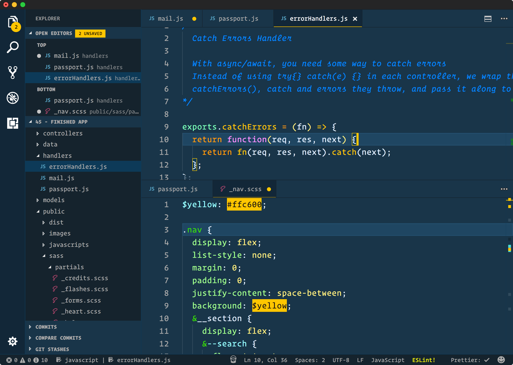

@title[Splash Page]
### Optimizing Development Workflow and Tooling
Help your future self!


Note:
Have Optimizes tool now so that you new techologies just work (with your workflow)
+++

### What is your Workflow/Tooling
* Tools, Applications and Process that assist in code development

Note:
Think of the collection of: Tools, Applications and Process that you use to complete tasks 

+++ 

### Why should you Optimize your Workflow/Tooling
- Easier to integrate the use of new technologies |
- Process of code development becomes easier/faster |
- Be prepared for the next "Big Thing" in software development |

Note: 
1 Having an Optimized workflow, allows adding new technologies to become very easy

2 (We should) try to automate routine things that are done all the time (I have an example)

3 Hockey refernce :  We should always be looking were the puck is going.

+++
 ### Optimizing Workflow and Tooling Recommendations
 -  Try to identify parts of your "Workflow" that could be optimized
 -  Can any part(s) of your "Workflow" or a tool you use be automated |
 -  Investigate new features, plugins, add-ons in currently used apps |
 -  Search for alternative applications that meets your needs |

Note:
Here are a few broad recommendations for Optimizing Workflow and Tooling

1 Can your work flow be improved

2 Look for routine things that can be automated

3 Are there any plugins that you are not using, that could make coding easier

4 Look at alternative applications  and decide if switching is the right move (for you)

---
## Examples

Note:
These are just a few examples, there are many more applications out if I do not cover your favorite  you will have a chance to speak up

I want to stress that this part is more of a "FYI these apps exist" than "I use an app over another"

Choose an app that make you efficient 

Have the mind set with these example apps of could help instead of should help 
---

### File Manipulation

Note:
App that edit and save file 

These apps can do so much more 

+++
### Q/A
* What Applications are you using to manipulate files  
* Why do you use this Application
* What do you like about this Application
* What do you dislike about this Application

Note:

1 - vscode 

2 - easy to use , built in features 

3 - like the plugin system 

4 - terminal can be better 

+++ 
### Vi(m)

Note:
advantages: its everywhere very customizabe 
disadvantages: could be challenging to get use to 
+++

 <a href="https://vimawesome.com/" target="_blank">Vimawesome Plugins</a>
 
+++
### Notepad++

<a href="http://docs.notepad-plus-plus.org/index.php/Plugin_Central" target="_blank">Notepad++ Plugins</a>     

Note:
advantages: simplistic easy to use an just works  
disadvantages:I find it lacks plugins 

+++
### VSCODE

Note:
advantages: plugin support and easy of use  
disadvantages: could be too much ; depends on what you are doing/editing 

+++


+++

 <a href="https://marketplace.visualstudio.com/" target="_blank">Vscode Plugins</a>
---

### Linting

+++
### Q/A
* What Applications are you using to lint files  
* Why do you use this Application
* What do you like about this Application
* What do you dislike about this Application

Note:

1 perl tidy/critic

2 best option at the moment 

3 can be the same  linting as bamboo

4 no code error help when coding 

+++
###  
 
+++
     
+++
### Linting in Perl: perl tidy/critic


---

### Customization
+++
### Q/A
* Do you customization your Applications/tools in your "Workflow"
* How do you customize them

Note:

1 Theme/customization support 

2 depends on the app I like to be minimal
+++ 

### Theming

Note:
Do you/can you change how your apps look
+++
### Vim

+++
 
+++

+++
### Notepadd ++ 

+++

+++

+++
### Vscode 

+++

+++

+++
### Navigation

Note:
How to navigate your workspace with and do you customize it 
+++


+++


---

### Remote Procedures

Note:
Doing something remotely

+++
### Q/A
* What Applications are you using to do Remote Procedures
* Why do you use this Application
* What do you like about this Application
* What do you dislike about this Application


Note:
I mainly do sql and log searching  -> docker

+++
### SSH
    
+++
### SFTP 


+++
Docker ?


Note: 

I do this instead of sshing into ascdev or sftping file on ascdev
---

### Software Management

Note: Managing the software that you use 
+++
### Q/A
* What Applications are you using to do software management
* Why do you use this Application
* What do you like about this Application
* What do you dislike about this Application


Note:
I use a lot of different methods to mange software 

+++
### Package manager
 
+++
### Git

```git clone <tool url>```
Note: 

git clone 
+++
### Binary/Installer 


Note:
exd/msi/dmg/ 
+++
### Docker
- docker run (OPTIONS) IMAGE (COMMAND) (ARG...)
- A simple management solution for Docker:<a href="https://portainer.readthedocs.io/en/latest/deployment.html#quick-start" target="_blank">Portainer</a> | 
- docker run -d -p 9000:9000 --restart always -v /var/run/docker.sock:/var/run/docker.sock -v /opt/portainer:/data portainer/portainer | 

Note:
docker run -d -p 9000:9000 --restart always -v /var/run/docker.sock:/var/run/docker.sock -v /opt/portainer:/data portainer/portainer
+++
# Demo
Note:
wont be a Pd presenation with out a docker demo
---
### A few of my optimizations

- Bitbucket search   -> ripgrep
- Docker for Windows -> Docker + VM |
- Notepad++          -> Vscode |
- MobaXterm          -> cmder/linux subsystem -> linux terminal |
- Powerline-shell |

Note:
These are some of my optimizations that I made; they could be useful but sometimes I still use the apps that they replaced ; depends on the task that I am doing
vagrant ,bash 

---

### Final Thoughts
* Does your "workflow" meet my current your needs ?
* What applications/process need to change 
* How to adapt your current "workflow" to meet your future needs
* Researching new apps/process that make your "workflow" easier
* Share your workflow

Note:
optimizing does not stop here with these examples it could be expanded to:

The way we program 

using libaraies to things 

if you have a tool you like share it
